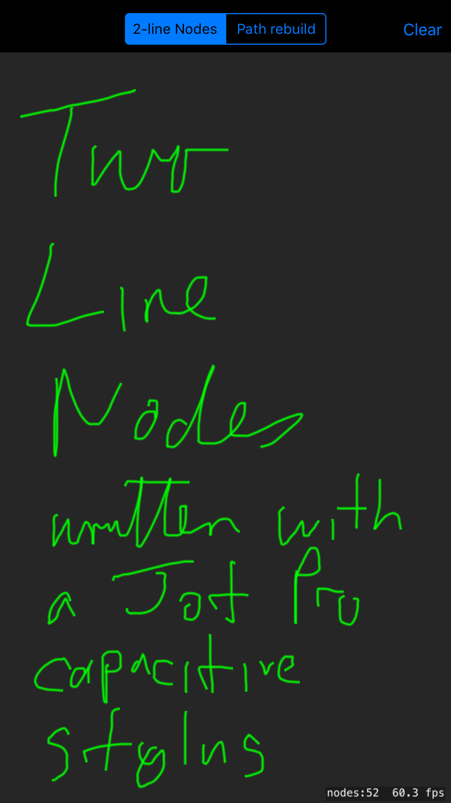
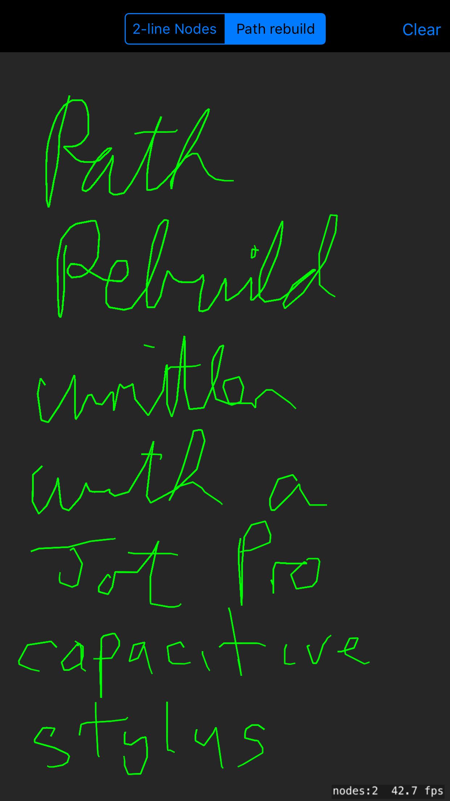
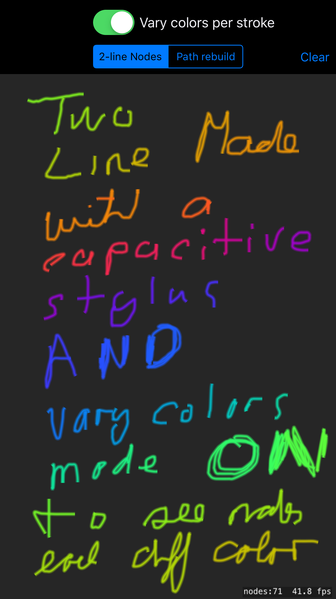

# SKScribbles
Exploring different ways to handle free-form drawing in SpriteKit with Swift

## Playground
`ShapeScribbling.playground` uses `SKShapeNode` to track a continuously updated drawing. 

Note that it ran into an interesting _behaviour_ in XCode 9.3 where appending nodes to an array caused a dramatic drop in interactive performance **in the playground only**.

## App
`ShapeScribble` is an iOS and macOS app using the logic from `ShapeScribbling.playground` to prove that it performs fine when compiled into apps. It compares three approaches (segment control at top of screen to pick mode):

* `GameScene2LineNodes` uses a set of nodes for **each** contiguous vector
	* As you draw, it adds a new `SKShapeNode` containing one short line, for each new point (more than 2.0 pixels in x or y from prev point). That is a massive number of tiny _temp nodes_ whilst you are drawing. The points are recorded in an array
	* On touch-up: 
		* The temp nodes are all removed.
		* If filling (see below), the points are closed
		* A new node is created from the array of points, using the `SkShapeNode(splinePoints:, count:)` init which allows SpriteKit a chance to optimise line paths and generate a smoother line. Note that if you draw many individual strokes, we still have multiple nodes - one node per contiguous stroke.
* `GameScenePathRebuilding` has **one big SKShapeNode**. 
	* As you draw, it builds up an array of points,adding a new point every time it is more than 2.0 in x or y from prev point.
	* On touch-up adds lines to the `CGMutablePath` of the single `SKShapeNode`. The path is re-assigned on each touch-up, causing the shapenode to regenerate its content. As we don't re-create the path, it ends up with multiple separate segments for each contiguous set of strokes.
* `GameSceneParticleCrayon` uses a particle emitter `Crayon.sks` to handle the drawing, moving it around. (it was added later so not in all screenshots)
  * The emitter has a _slow fade_ built in specified by the `Alpha - Speed`.
  * (If you are unfamiliar with emitters) - you have a visual editor clicking on the Crayon file. If you click and draw in the main area you will see the emitter move much as it does in the app. This gives you an accurate idea of how fast it is fading.
  * To get a _heavier_ line:
    * Increase the `Emitter - Birthrate` so more particles appear
    * Increase the `Position Range` both `X` and `Y` values, maybe from 2 to 4. This scatters the particles a bit more as they are being emitted, like a wider crayon.
  * **Warning** If you change parameters in the visual editor, do a Clean and Build to ensure they are picked up by the app (Xcode bug?).
  * on touch-up: the emitter birth rate is set to zero. This stops further dots appearing otherwise it would be like leaving a leaky pen on the paper.
    
## Effects of different approaches

Scribbling with my awkward handwriting and an Adonit Jot Pro stylus on an iPhone provides testing of a mix of tight turns and tiny strokes.

### 2LineNodes approach

 

With the screenshots blown up you can also see the _glow_ effect applied on Lines2Node. 

To my eye, PathRebuild is a little bit more jerky as each set of points is connected with a straight line, so when moving fast they have no smoothing. This is most noticeable on the capital P of _Pro_

## Varying Colors

Using [Chris Goldsby's color sequence iterator](https://github.com/cgoldsby/Sequences) different colors are generated for subsequent strokes (except on the Particle Crayon mode).

This makes the different pattern of adding strokes really clear - when you turn this on and draw lots of different strokes in 2LineNodes, each ends up as a different color.

With PathRebuild, the color for the **entire path** changes ever time you draw a new stroke.

In the following shot, note that I also doubled the _glow_ parameter to 4.0.

 

## Fill Mode
On the vector drawing, first two modes (not Particle Crayon), you can also toggle a _Fill_ mode. This has very different effects, on the 2LineNodes panel you see the shape you drew closed and filled. This confirms this is the best approach to draw a series of bounding, filled shapes, which was the main aim of adding the feature.

The effect with PathRebuilding is a lot more dynamic as different curve segments are alternatively filled - have fun playing with it and working out what's going on.