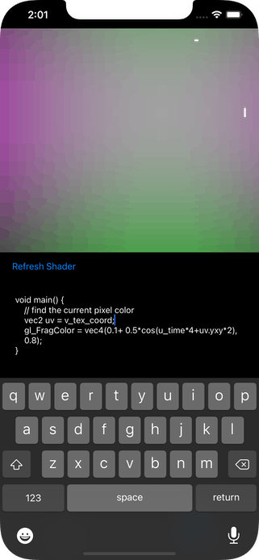

# SKShaderToy

A testbed for shader editing for shaders used by SpriteKit.

Most shaders are available as examples for [ShaderToy][ST] but there are minor differences between the GLSL used there and that of SpriteKit.

Note that much of this will refer to `tg` classes from [Touchgram][tg] as it's a testbed for some ideas used in that app.

[ST]: https://www.shadertoy.com/
[tg]: https://www.touchgram.com/
