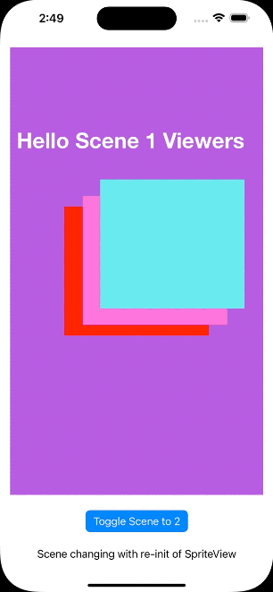

# SkinSuit

Testing how to embed SpriteKit within a SwiftUI App.

The _simple way_ is to use [SpriteView][SV] as shown in [Paul Hudson's tutorial][HWS].

However, that has two limitations:

1. It requires a prebuilt Scene which will be resized to match later, which is counter to the way [touchgram][tg] builds its scene.
2. The `SpriteView` lacks any way for SpriteKit to change scenes other than via recreation.

## Bugs in SpriteView behaviour
The most obvious and one I didn't find a workaround for is that the transition parameter is completely ignored when you init a [SpriteView with transition][SVi].

The subtle second bug occurs when you reuse the scene - after toggling a couple of times a blank gray view appears. Repeated tapping on the toggle button _sometimes_ shows the correct image. This is regardless of specifying the transition so is unlikely to be the [retention bug previously observed][sb].

Both of these are regarded as intractable - will leave this as is to demonstrate this behaviour.

## SKView inside SwiftUI
The escape hatch of [UIViewRepresentable][rep] is used by `SKViewApproach`.

Note some weird behaviour when this was the 2nd tab, it didn't appear to do the presentScene, **unless** the first tab had interacted. This may be the [transition bug][sb] in action. I recommend strongly against mixing using `SpriteView` in an app that also uses `SKView` even if on different screens.

Using different tabs as shown here is a bit more problematic for cleanup - it shouldn't be a problem but note [dismantleUIView][dv] is **not** invoked just changing tabs - it would only be when going to another screen.

[HWS]: https://www.hackingwithswift.com/quick-start/swiftui/how-to-integrate-spritekit-using-spriteview
[SV]: https://developer.apple.com/documentation/spritekit/spriteview
[SVi]: https://developer.apple.com/documentation/spritekit/spriteview/3592999-init
[tg]: https://www.touchgram.com/
[sb]: https://medium.com/touchgram/oops-hitting-a-5yo-apple-bug-17d2703519f4
[rep]: https://developer.apple.com/documentation/swiftui/uiviewrepresentable
[dv]: https://developer.apple.com/documentation/swiftui/uiviewrepresentable/dismantleuiview(_:coordinator:)-5lee7
