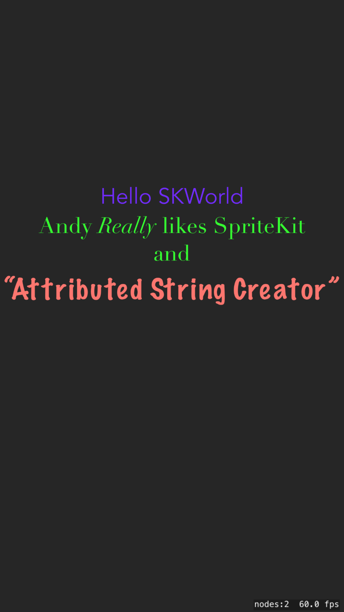

# StyledTextOverSK

Test of putting overlays of text on top of a SpriteKit app.

In particular, mimic typical meme layout with an overlay that stands out against a background picture.

## The Exploration
The initial template for an SK game displays a Hello World using an [SKLabelNode] that is constructed in the initial `GameScene.sks` - you can edit it in the Scene visual editor.

This node type supports a single style specifying font name, size, style and color, **or** using an [NSAttributedString] which allows for inline changes of font attributes. It is still a single line of text with control over how it wraps but no easy way to use multiple lines (inserting line breaks programmatically may work)

### Attributed String Issues
Although the visual scene editor apparently allows you to specify the colour, this doesn't seem to persist and translate into runtime.

**Attributed Strings for SKLabelNode were added in iOS 11**.

The visual editor supports attributed strings but not wrapping them with inserted linebreaks. If you set the modes correctly, as mentioned below, they will wrap.

There was a useful gist on building multiple label nodes `SKMultilineLabel` by [Craig Grummitt][CG] but only taking a single style and breaking the word wrapping (note this **is** a complex issue!).

You can use a combination of:

    label.lineBreakMode = .byWordWrapping
    label.numberOfLines = 0 

To get wrapped text - the key is specifying the `numberOfLines` as the default is to a single line.

## App Build
Created using XCode 9.4.1 "ios Game" template

[SKLabelNode]: https://developer.apple.com/documentation/spritekit/sklabelnode
[NSAttributedString]: https://developer.apple.com/documentation/foundation/nsattributedstring
[CG]: https://gist.github.com/craiggrummitt/03bfa93c07e247ee9358
