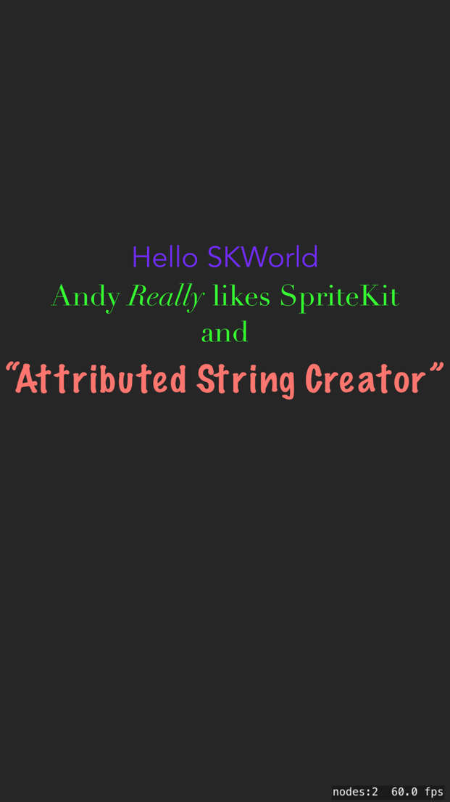

# StyledTextOverSK

Test of putting overlays of text on top of a SpriteKit app.

In particular, mimic typical meme layout with an overlay that stands out against a background picture.

Tapping the screen will switch to a different rendering technique at the end of the touch. If you tap and drag you will see the trail of rectangles which is standard for an SK game.

## The Exploration
The initial template for an SK game displays a Hello World using an [SKLabelNode] that is constructed in the initial `GameScene.sks` - you can edit it in the Scene visual editor.

This node type supports a single style specifying font name, size, style and color, **or** using an [NSAttributedString] which allows for inline changes of font attributes. It is still a single line of text with control over how it wraps but no easy way to use multiple lines (inserting line breaks programmatically may work)

The sample builds for iOS 9 and when it runs there, the first rendering mode will be mono. On iOS 11 and later, the `SKLabelNode` is capable of displaying an attributed string - see `makeLabelNode.`

The second rendering mode uses UIView objects overlaid on the SKView as sub views. Using a UILabel allows you to use attributed strings regardless of the version. See `makeUILabelOverlay`

The third test rendering mode uses a web view and HTML to provide the formatting. See `makeWebOverlay`. Because the HTML is over the top, you cannot see your interaction with SpriteKit.

The fourth test (pink background) is the same as the third but puts the HTML **behind** the SpriteKit view, turning it transparent. That allows for interaction with SpriteKit still.  **Warning this may flicker violently on the simulator.** if it appears there at all. See `makeWebUnderlay`.

### Failed Test
The failing fifth test rendering mode redraws the same web view but saves an image of it and adds that as a SpriteKit node. (with the yellow background). It uses the helper class `WebviewImageCapturer` because capturing an image is an async activity only possible after the original finishes rendering. See `makeWebImage.`

**I give up** but thought the extra exploration was worth pushing for people to see.

## Attributed String Issues
Although the visual scene editor apparently allows you to specify the colour, this doesn't seem to persist and translate into runtime.

**Attributed Strings for SKLabelNode were added in iOS 11**.

The visual editor supports attributed strings but not wrapping them with inserted linebreaks. If you set the modes correctly, as mentioned below, they will wrap.

There was a useful gist on building multiple label nodes `SKMultilineLabel` by [Craig Grummitt][CG] but only taking a single style and breaking the word wrapping (note this **is** a complex issue!).

You can use a combination of:

    label.lineBreakMode = .byWordWrapping
    label.numberOfLines = 0 

To get wrapped text - the key is specifying the `numberOfLines` as the default is to a single line.

## The WKWebView snapshot saga
The fifth sample was supposed to be the dream, combining the flexibility of HTML rendered in a web view with getting it into a SpriteNode for all kinds of manipulations.

The only trouble is, [WKWebView.takeSnapshot](https://developer.apple.com/documentation/webkit/wkwebview/2873260-takesnapshot) seems to be very buggy on devices. 

See [this StackOverflow question](https://stackoverflow.com/questions/46842384/wkwebkit-takesnapshotwith-snapshotconfiguration-not-working-on-ios-device) and [this one](https://stackoverflow.com/questions/26843804/i-cant-capture-the-screenshot-of-a-wkwebview) with the bleak conclusion you can only grab snapshots **after** you get the web view visible.

## App Build
Created using XCode 9.4.1 "ios Game" template

[SKLabelNode]: https://developer.apple.com/documentation/spritekit/sklabelnode
[NSAttributedString]: https://developer.apple.com/documentation/foundation/nsattributedstring
[CG]: https://gist.github.com/craiggrummitt/03bfa93c07e247ee9358
