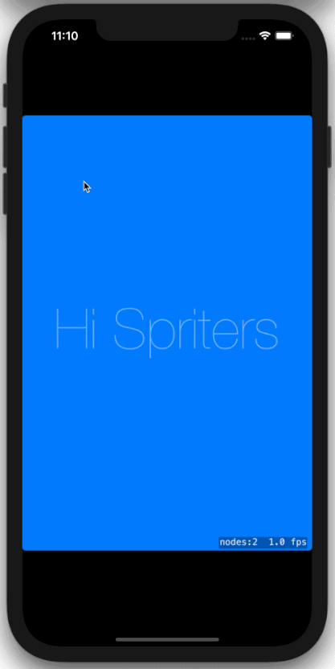

# ThrobsAndBobs

Test of different ways to have a simple shape pulse and move.

Every alternate touch either creates a heart throbber or a circle that follows a heart path.

Specifically, I want to have a _mildly animated_ prompt in [Touchgram][tg] that hints to the user where they should be stroking. Internally, we have a series of coordinates which are already used to draw an [SKShapeNode][SKShape] if the creator of the Touchgram requests a static prompt (typically mostly transparent).

## Credits
Uses `ShaderKitExtensions.swift` from [twoStraws][ShKit]

The throbbing heart originally from [Inigo Quilez on ShaderToy](st1).

The disc originally from [smkgames on ShaderToy](st2).

## The Exploration

This reflects just not knowing what performance is like for different alternatives and also considering how they may fit in with aspects of [Touchgram][tg].

### Throbbing

Initial ideas are that a _throbbing_ shape can be accomplished, at least, by:

- an [SKShader][SKSd] rendering the entire shape and varying it over time or position, useful for inbuilt components and I suspect the most efficient way to provide this
- an [SKAction][SKA] animating through a set of [SKTextures][SKT] - typical game technique but maybe more awkward when loading user generated content
- an [SKAction][SKA] that changes the [scale] of an original graphic node.

Note that there's a massive set of SKActions you choose from with a factory function they call an [initializer][init] as well as being able to 

### SKAction-based pulse
The default template for a SpriteKit game includes a file `Actions.sks` which defines an action `Pulse`. That is invoked in `GameScene.swift`

### Motion

I'm only going to explore this with [SKAction][SKA] and possibly not get to it in this first demo but wanted to include it here at least as a placeholder. The main approach we are likely to use is [following along a path][follow]

[SKA]: https://developer.apple.com/documentation/spritekit/skaction
[SKShape]: https://developer.apple.com/documentation/spritekit/skshapenode
[SKShd]: https://developer.apple.com/documentation/spritekit/skshader
[scale]: https://developer.apple.com/documentation/spritekit/skaction/1417741-scale
[init]: https://developer.apple.com/documentation/spritekit/skaction/action_initializers
[tg]: https://www.touchgram.com
[follow]: https://developer.apple.com/documentation/spritekit/skaction/1417822-follow
[ShKit]: https://github.com/twostraws/ShaderKit
[st1]: https://www.shadertoy.com/view/XsfGRn
[st2]: https://www.shadertoy.com/view/XtBcWh
