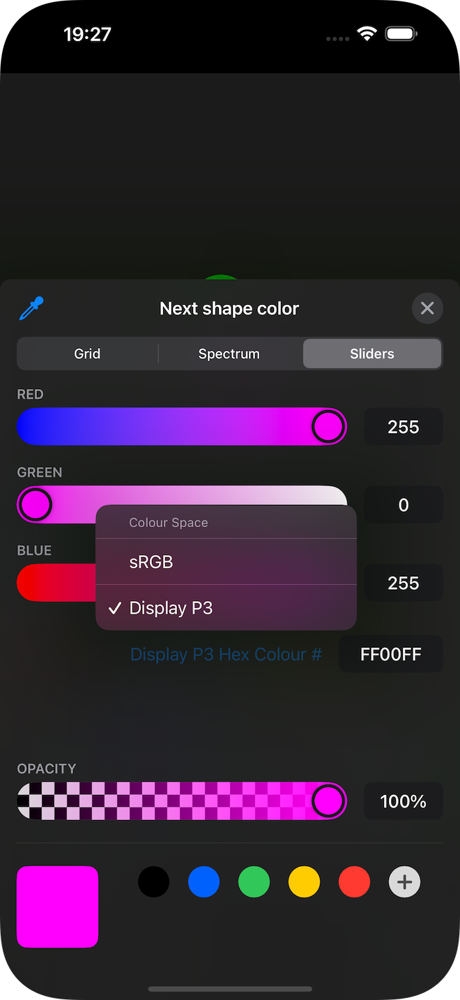
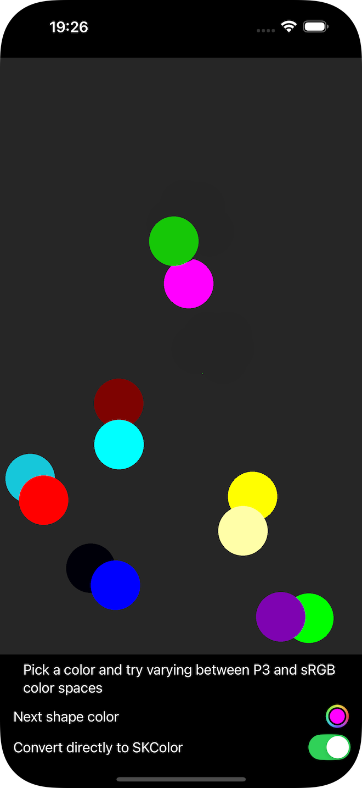

# ToP3orNotToP3

A sample program that draws colored dots on a SpriteKit surface, to explore how picking and DisplayP3 space interact with the conversion.

If you're not familiar with SpriteKit, it has an [SKColor][a2] which is a simple `typealias` for the original app types `UIColor` and `NSColor`. This makes life more interesting in a SwiftUI world.


## Background
I was evaluating using extended colors in [Touchgram][tg] and [Purrticles][p1] because the iOS colour picker allows picking Display P3 Hex in its slider view.



That means you can pick colors in P3 space which are outside the sRGB range. 

- FF00FF magenta
- FF0000 red
- 00FFFF teal
- 0000FF blue
- 00FF00 green

## The iOS bug
There is (arguably) a [bug in SpriteKit][o1] where, when you pass in colours that are outside the sRGB range, it just wraps the values that are less than 0.0 (sometimes very small magnitudes such as 9.667876383900875e-07) or greater than 1.0.

Passing a SwiftUI `Color` directly into the `UIColor` constructor triggers the bug. ie: **the simplest behaviour results in weird colors**.

It doesn't occur with `NSColor` on macOS.

As you can see in the screenshot below, the more vibrant colors in the P3 space can be converted to sRGB space to get the desired bright colors. However, if the _Convert directly to SKColor_ option is selected, the wraparound gives bizarre results. The pairs of dots show the properly-converted color (the brighter one) adjacent to a dull and often opposite-hued one.




### The Fix 
The fix is in [ColoredShapeSceneMaker.swift][s1]

```
if let asCG = pickedColor.cgColor {
#if os(iOS)
    if let space = asCG.colorSpace {
        if space.name == CGColorSpace.displayP3 {
            // convert to sRGB because of SpriteKit bug doing wraparound
            if let rgbSpace = CGColorSpace(name: CGColorSpace.sRGB),
               let asRGB = asCG.converted(to: rgbSpace, intent: .defaultIntent, options: nil) {
                return SKColor(cgColor: asRGB)  // clean convert
            }
        }
    }
```

### Warning
The fix relies on [Color.cgColor][a1] which is marked as _Deprecated in iOS 18.4 and macOS 15.4_ - see [issue 5][gh1].

[a1]: https://developer.apple.com/documentation/swiftui/color/cgcolor
[a2]: https://developer.apple.com/documentation/spritekit/skcolor-swift.typealias
[tg]: https://www.touchgram.com
[gh1]: https://github.com/AndyDentFree/SpriteKittenly/issues/5
[o1]: http://www.openradar.me/31581040
[p1]: https://www.touchgram.com/purrticles
[s1]: ./ToP3orNotToP3/ColoredShapeSceneMaker.swift
[u1]: https://developer.apple.com/documentation/uikit/uicolor/getred(_:green:blue:alpha:)